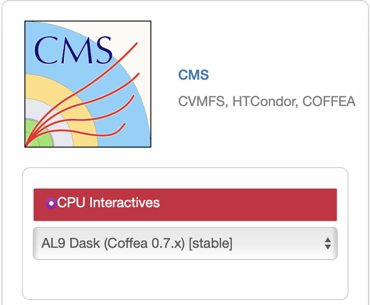
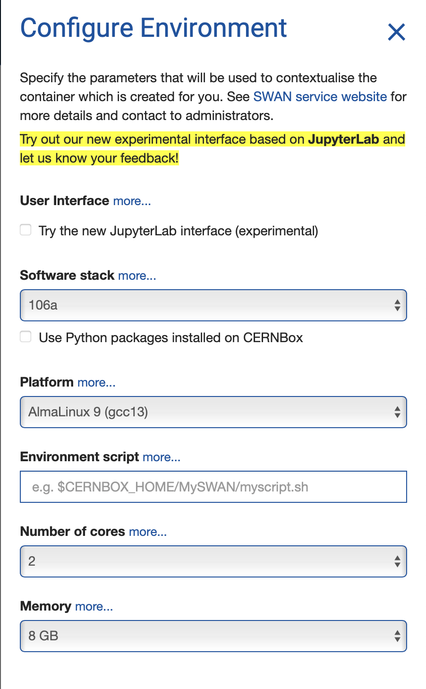

# Heavy resonance tagging (HRT)
# CMS DAS 2025

Repository for the Heavy Resonance Tagging exercise for CMSDAS@LPC2025 - https://twiki.cern.ch/twiki/bin/view/CMS/SWGuideCMSDataAnalysisSchoolLPC2025TaggingExercise

The tutorial is heavily based on the jet tagging tools and framework/files.

Produced for the BoostedJet Tagging paper [JME-18-002](http://cms.cern.ch/iCMS/analysisadmin/viewanalysis?id=2101&field=id&value=2101&name=Heavy%20jet%20tagging%20algorithms%20in%2013%20TeV%20data%20(2016%20dataset)) and the corresponding HATS.

DAS exercise in [2024](https://github.com/irenedutta23/HATS_HRT/tree/DAS2024)

DAS exercise in [2023](https://github.com/IreneZoi/HATS_HRT/tree/DAS2023)

DAS exercise in [2022](https://github.com/cms-jet/HATS_HRT/tree/DAS2022)

HATS exercise in [2021](https://github.com/cms-jet/HATS_HRT/tree/HATS2021)

HATS exercise in [2020](https://github.com/gouskos/HATS2020_HRT/blob/master/README.md)

This exercise works on Fermilab EAF.


## Setup on FNAL Elastic Analysis Facility (EAF) 
To run on FNAL EAF, you will need to be on the Fermilab fgz network (if you are onsite) or use a VPN (if you are offsite, https://redtop.fnal.gov/guide-to-vpn-connections-to-fermilab/). Then login at  https://analytics-hub.fnal.gov using your FNAL Services credentials. Once you successfully connect, select CMS - CPU Interactives - AL9 Dask (Coffea 0.7.x) [stable](top left) server options, as shown in the image below. 



Click Start at the bottom of the page.

To open a Terminal click on the corresponding option in the Launcher Tab. If the Launcher tab is not open, you can open a new one from the File menu in the top left. This will open a new tab with a bash terminal.

### Upload Grid Certificates - first time only!
We will copy your grid certificates from the LPC cluster, to do this, got to the terminal you just opened.

Execute the following commands (following the appropriate prompts) to copy your certificate from the LPC to Jupyter (**note**: replace `username` with your `FNAL` username!)

The following command will prompt you for your FNAL password
```bash
kinit username@FNAL.GOV
rsync -rLv username@cmslpc-el9.fnal.gov:.globus/ ~/.globus/
chmod 755 ~/.globus
chmod 600 ~/.globus/*
kdestroy
```

#### Initialize Your Proxy at every Login!
If you have a password on your grid certificate, you'll need to remember to execute the following in a terminal *each time you log in to Jupyter*. Similar to the LPC cluster, you will get a new host at each logon, and the new host won't have your old credentials.

Each time you log in, open a terminal and execute:
```bash
voms-proxy-init -voms cms -valid 192:00
```

#### Checkout the code
Open up a terminal and run the following command from your home area:
```bash
git clone https://github.com/IreneZoi/HATS_HRT.git das2025_hrt
```

On the left you should see the `das2025_hrt` directory you created. Double click to go in it. Now double click on the notebook [HeavyResonanceTagging.ipynb](HeavyResonanceTagging.ipynb). Select the Python3 (Safe mode) kernel. 


#### Exercise
Run the notebook [HeavyResonanceTagging.ipynb](HeavyResonanceTagging.ipynb).
First run the various cells. There are instructions as you go and a list of exercises at the end of the notebook.

## Setup on SWAN (CERN)
Login at https://swan-k8s.cern.ch/ using your CERN credentials. Once you successfully connect, select the default environmentas shown in the image below.




Each time you log in, open a terminal and execute:
```bash
voms-proxy-init -voms cms -valid 192:00
```

#### Checkout the code
Open up a terminal and run the following command from your home area:
```bash
git clone https://github.com/IreneZoi/HATS_HRT.git das2025_hrt
```

You should now find the `das2025_hrt` directory in your `CERNbox`. Double click to go in it. Now double click on the notebook [HeavyResonanceTagging.ipynb](HeavyResonanceTagging.ipynb). Select the Python3 kernel. 

#### Exercise
Run the notebook [HeavyResonanceTagging.ipynb](HeavyResonanceTagging.ipynb).
First run the various cells. There are instructions as you go and a list of exercises at the end of the notebook.
